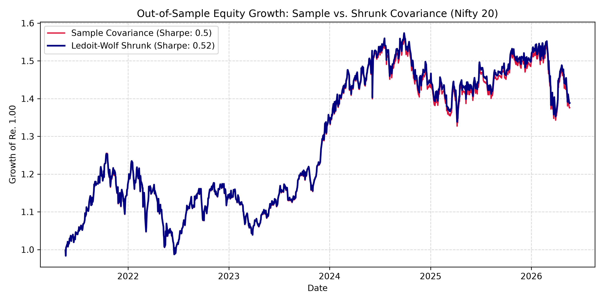

# Convex Portfolio Optimization with Ledoit-Wolf Spectral Shrinkage

An institutional quantitative modeling engine formulated in `CVXPY` that demonstrates the failure modes of empirical sample covariance in high-dimensional portfolio selection ($N \approx T$) and evaluates Ledoit-Wolf optimal shrinkage under realistic market frictions.

---

## 1. Problem Formulation

In classical Markowitz mean-variance optimization, an allocator chooses a capital vector $w \in \mathbb{R}^N$ over $N$ risky assets to maximize risk-adjusted expected return:

$$\max_{w} \quad w^T \mu - \frac{\gamma}{2} w^T \Sigma w$$

Subject to institutional execution constraints:
1. **Full Investment:** $\mathbf{1}^T w = 1$
2. **Long-Only Allocation:** $w_i \ge 0, \quad \forall i \in \{1, \dots, N\}$
3. **Concentration Bound:** $w_i \le c_{\max}, \quad \forall i$
4. **Turnover Regularization:** $\Vert{}w_t - w_{t-1}\Vert{}_1 \le \tau$

Where $\mu \in \mathbb{R}^N$ is the vector of annualized expected returns, $\gamma > 0$ is the risk-aversion parameter, and $\Sigma \in \mathbb{R}^{N \times N}$ is the true covariance matrix.

---

## 2. The Theoretical Failure Mode: The "Error Maximizer"

In sample windows where $T$ is small relative to $N$, the empirical sample covariance matrix:

$$S = \frac{1}{T-1} \sum_{t=1}^T (x_t - \bar{x})(x_t - \bar{x})^T$$

suffers from spectral dispersion (governed by the Marcenko-Pastur distribution). The smallest eigenvalues of $S$ are systematically depressed toward zero ($\lambda_{\min} \to 0$), representing spurious cross-asset cancellation discovered purely through small-sample noise.

Because the convex quadratic program minimizes variance:

$$w^T S w = \sum_{i=1}^N c_i^2 \lambda_i$$

the solver places the largest weights onto the eigenvectors corresponding to the smallest eigenvalues. The optimizer functions as an **error maximizer**, creating overfitted positions that experience severe drawdowns out-of-sample.

---

## 3. The Analytical Solution: Optimal Shrinkage

Following Ledoit and Wolf (2004), we regularize $S$ by shrinking it toward a well-conditioned scalar target $F = \bar{\lambda} I$, where $\bar{\lambda} = \frac{1}{N}\text{Tr}(S)$:

$$\hat{\Sigma}_{\text{shrunk}} = (1 - \delta^*) S + \delta^* F$$

The parameter $\delta^* \in [0, 1]$ is derived analytically by minimizing the expected Frobenius loss $\mathbb{E}[\Vert{}\hat{\Sigma} - \Sigma\Vert{}_F^2]$.

This transformation lifts the spectral floor:

$$\lambda_i^{\text{shrunk}} = (1 - \delta^*) \lambda_i + \delta^* \bar{\lambda}$$

eliminating the near-zero eigenvalue arbitrage that corrupts quadratic solvers.

---

## 4. Empirical Performance & Out-of-Sample Results

Across rolling out-of-sample rebalances on the Nifty 20 universe with a 10 bps transaction cost friction:

| Metric | Sample Covariance ($S$) | Ledoit-Wolf Shrunk ($\hat{\Sigma}$) |
| :--- | :--- | :--- |
| **Condition Number ($\kappa$)** | 121.11 | **50.99** |
| **Spectral Floor ($\lambda_{\min}$)** | 0.000029 | **0.000061** |
| **Sharpe Ratio (Net of Fees)** | 0.50 | **0.52** |
| **Max Drawdown** | -21.39% | **-21.25%** |



---

## 5. Execution Pipeline

```bash
git clone [https://github.com/gauriiizz/convex-portfolio-optimization.git](https://github.com/gauriiizz/convex-portfolio-optimization.git)
cd convex-portfolio-optimization
pip install -r requirements.txt
python run_pipeline.py
